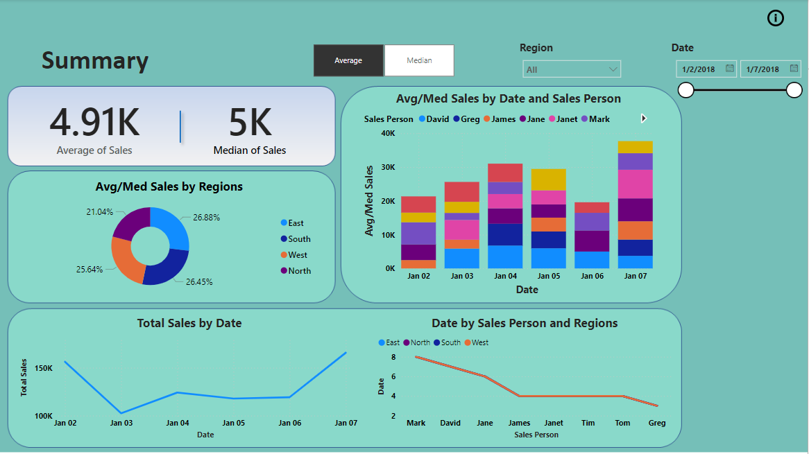
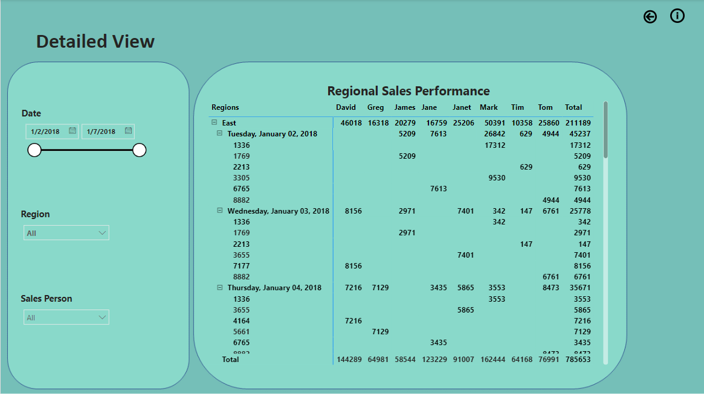
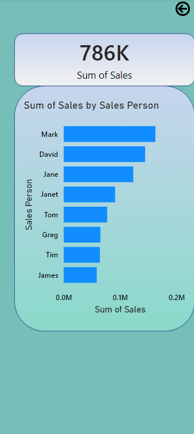

# Sales Performance Analysis

This Power BI dashboard visualizes the overall performance of a business's sales operations, helping stakeholders understand key trends and KPIs.

## 🔧 Tools Used
- Microsoft Power BI

## 📊 Dashboard Features
- Total Sales, Units Sold, and Profit KPIs
- Monthly and Quarterly sales trends
- Region-wise and Product Category analysis
- Top performing sales reps

## 🧠 Insights Delivered
- Identification of peak sales months
- Performance of each product category
- Regional sales patterns and growth opportunities

## 📁 Files Included
- Dashboard screenshots (, , )

[Download the power BI file]

## Author
**Ernest Yesufu**
Data Analyst | SQL, Python, Excel & Power BI
Based in United Kingdom

## 🔗 Live Portfolio View
https://nextoyes99.github.io/ernestyesufu.github.io/
